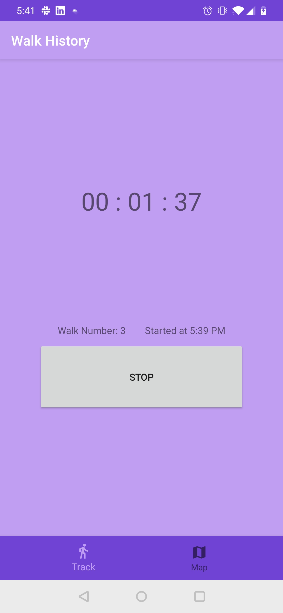
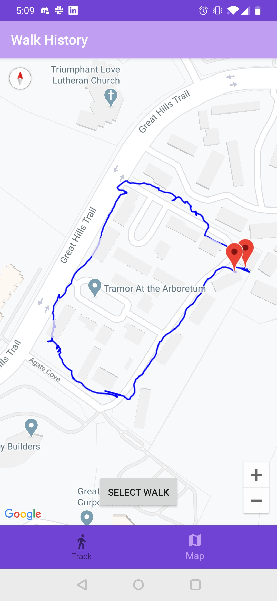
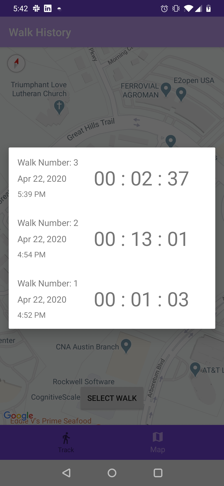

# Walk Tracker App

## Simplistic Walk Tracking

Technologies used:
Kotlin
Koin (DI)
Coroutines + Flow
LiveData
Room

Not a heavy emphasis put on UI so that part is a little rough
I wanted to get as much done as possible in a few days, so functionality was the primary concern

